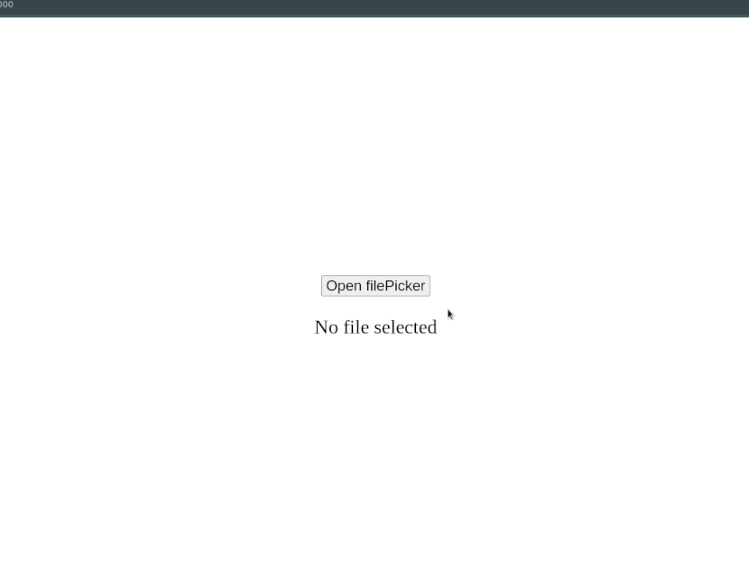

# fpicker

This golang package provides a file selection dialog for web applications, granting access to complete local file system paths. Unlike standard HTML <code><input type="file" ...></code> dialogs, which limit access to file paths, **fpicker** offers a versatile alternative for local web app development eliminating the need for complex frameworks.

**Important Note:**
Please be aware that this package does not perform any write, delete, or modification operations on local files. However, since it exposes the directory structure of the file system, it should only be used in secure, local environments. Recommended scenarios include integration into emulator frontends, system utilities, and similar use cases.  

<p align="center"></p>  

## Features
- Web dialogs for file and folder selection
- Quick access to the Home directory and disk drives
- Hidden file filtering
- Supports Linux and Windows (Other OS not tested)  


## Installation
```bash
go get github.com/jjcapellan/fpicker
```

## Usage
This package provides the following api endpoints to interact with the file or folder picker in your web application:
- (GET)  **/fpicker/file-picker** : Retrieves the file picker page. fpicker registers its own handler to the DefaultServeMux.
- (GET)  **/fpicker/folder-picker** : Retrieves the folder picker page. fpicker registers its own handler to the DefaultServeMux.
- (POST) **/fpicker/selected-file?path={full path of selected file}** : this request is sent by "select" button of the picker dialog. You must implement a handler for this route.
- (POST) **/fpicker/selected-folder?path={full path of selected folder}** : this request is sent by "select" button of the picker dialog. You must implement a handler for this route.  

## Example
This example corresponds to the content of the animated gif in this readme. Clicking the button opens the file picker in a new window, and after selecting a file, this window closes, and the file path is displayed on the screen.  
### Content of file "/public/index.html"
For the sake of simplicity, all the CSS, JavaScript, and HTML code has been included in the same file.  

```html
<!-- some html code here[...] -->
<body>
    <div class="container">
        <button class="button" id="bt-open-file">Open filePicker</button>
        <span id="content">No file selected</span>
    </div>

    <script>
        const button = document.getElementById("bt-open-file");
        const content = document.getElementById("content");

        // The file picker sends the selected file path to the backend, 
		// which forwards it to this page through a server-side events (SSE) stream.
        const eventSource = new EventSource("/sse");
        eventSource.addEventListener("file", (evt) => {
            content.innerText = evt.data;
        });

        button.addEventListener("click", handler);

        function handler() {
            const width = 1100,
                  height = 800,
				  offset = 48, // Aprox.
                  left = window.innerWidth / 2 - width / 2,
                  top = window.innerHeight / 2 - height / 2 + offset;
			// The URL "/fpicker/file-picker" retrieves the file picker page
            window.open("/fpicker/file-picker", "Select file", `width=${width},height=${height},left=${left},top=${top}`);
        }
    </script>
</body>
</html>
```  

### Content of file "main.go"
The file picker doesn't directly send the selection back to the invoking page but instead utilizes the backend as an intermediary. To relay the file picker's selection back to the client, the backend inserts it into the server-sent events (SSE) stream being listened to by the client.  


```go
package main

import (
	"fmt"
	"log"
	"net/http"

	"github.com/jjcapellan/fpicker"
)

var ch chan string = make(chan string)

func main() {

	fs := http.FileServer(http.Dir("./public"))
    
	// You must handle the route where the selectionn is sent by the file picker
	http.HandleFunc(fpicker.SelectedFileUrl, handleSelectFile)

	// In this example the route "/sse" is used by an events stream as way to send data to the client
	http.HandleFunc("/sse", handleSSE)

	http.Handle("/", fs)

    // fpicker uses the default servemux
	log.Print("Listening on :3000...")
	err := http.ListenAndServe(":3000", nil)
	if err != nil {
		log.Fatal(err)
	}
}

// This function forwards the file picker selection (path) to the "ch" channel within a server-side event
func handleSelectFile(w http.ResponseWriter, r *http.Request) {
	filePath := r.URL.Query().Get("path")
	eventStr := "event: file\ndata: " + filePath + "\n\n"
	ch <- eventStr
}

// This function sends the event containing the file picker selection to the client
func handleSSE(w http.ResponseWriter, r *http.Request) {
	w.Header().Set("Content-Type", "text/event-stream")
	w.Header().Set("Cache-Control", "no-cache")
	w.Header().Set("Connection", "keep-alive")

	select {
	case eventStr := <-ch:
		fmt.Fprint(w, eventStr)
		w.(http.Flusher).Flush()
	case <-r.Context().Done():
		return
	}
}
```